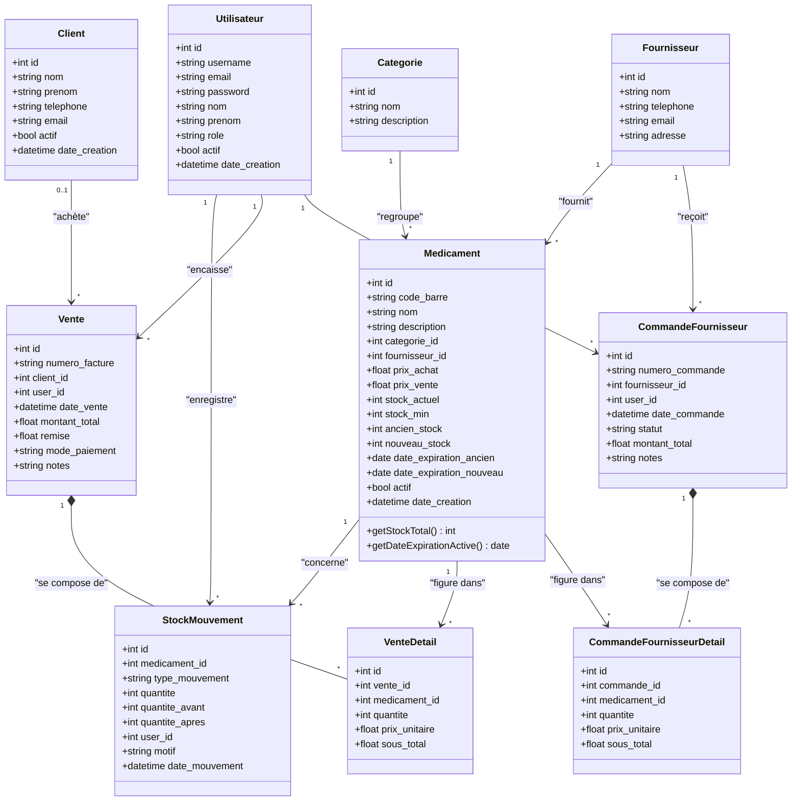

# 📐 Diagramme de Classes (Class Diagram)

Ce diagramme de classes représente la structure logique du domaine et de la persistance de **FIANGEP Pharma**. Bien que le projet soit développé en PHP natif procédural/hybride, la base de données relationnelle et la structure d'accès aux données (par le biais du Singleton `Database`) sont modélisables de manière orientée objet, facilitant la compréhension des entités, de leurs attributs et de leurs interrelations.

---

## 🧜‍♂️ Diagramme Mermaid

---

## 📝 Description des Classes et Relations

### 1. Le Connecteur de Données (`Database`)
Cette classe implémente le patron de conception **Singleton** (constructeur privé `-Database()` et méthode statique d'accès `+getInstance()`). Elle encapsule la connexion PDO brute et fournit des méthodes d'abstraction de haut niveau (`select()`, `execute()`) pour sécuriser les appels en utilisant systématiquement des requêtes préparées avec typage des variables d'entrées. Elle intègre également la gestion transactionnelle (`beginTransaction()`, `commit()`, `rollback()`) indispensable lors de la facturation multi-articles.

### 2. Le Bloc Médicaments et Logistique (`Medicament`, `Categorie`, `Fournisseur`)
* **`Medicament`** : L'entité centrale de l'application. Elle contient à la fois les informations de base (prix, code-barres, seuils minimums) et les attributs du **double lot de stock** (`ancien_stock`, `nouveau_stock`, `date_expiration_ancien`, `date_expiration_nouveau`) qui permettent au moteur FEFO de calculer la priorité de déstockage.
* **`Categorie`** : Permet de classifier les produits (ex : Antibiotiques, Antalgiques, Consommables).
* **`Fournisseur`** : Retranché dans la base pour tracer la provenance des lots de réapprovisionnement.

### 3. Le Bloc Commandes Fournisseurs (`CommandeFournisseur`, `CommandeFournisseurDetail`)
* **`CommandeFournisseur`** : Représente une commande générée pour un fournisseur par un Magasinier ou un Directeur. Elle possède un statut (en_attente, confirmee, livree, annulee) permettant le suivi.
* **`CommandeFournisseurDetail`** : Lignes détaillées d'une commande passée au fournisseur.

### 4. Le Bloc Facturation et Mouvements (`Vente`, `VenteDetail`, `Client`, `StockMouvement`)
* **`Vente`** : Représente la facture finale globale. Elle est liée de manière forte et obligatoire à un **`Utilisateur`** (le Caissier ou Directeur qui a initié l'encaissement) et de manière optionnelle à un **`Client`** (permettant la vente directe anonyme).
* **`VenteDetail`** : Ligne d'écriture détaillée de la facture. C'est une table de jonction associative avec composition forte (`*--`) reliant la vente globale et les différents médicaments achetés.
* **`StockMouvement`** : Traceur historique. Chaque opération sur le stock (qu'elle soit issue d'une vente FEFO, d'une réception de commande, ou d'un ajustement manuel de stock) produit une instance de mouvement indiquant la variation exacte de stock (`quantite_avant` $\rightarrow$ `quantite_apres`).
