# 🧱 Diagramme de Composants (Component Diagram)

Ce diagramme de composants décrit la structure physique et logique de l'application **FIANGEP Pharma**. Il met en évidence la modularité du code PHP, les dépendances entre les couches d'interface utilisateur, la logique métier, les services de persistance et d'impression, organisés selon un motif d'architecture **3-Tiers / MVC** appliqué en PHP natif.

---

## 🧜‍♂️ Diagramme Mermaid

```mermaid
graph TD
    %% Définitions de styles
    classDef browser fill:#eff6ff,stroke:#22c55e,stroke-width:1.5px,color:#1e3a8a;
    classDef php fill:#faf5ff,stroke:#7c3aed,stroke-width:1.5px,color:#4c1d95;
    classDef db fill:#ecfdf5,stroke:#059669,stroke-width:1.5px,color:#064e3b;
    classDef helper fill:#fff7ed,stroke:#ea580c,stroke-width:1.5px,color:#7c2d12;

    %% Couche Client / Browser
    subgraph CouchePresentation["Couche Présentation (Client Browser)"]
        direction LR
        UI["🖥️ Interface Bootstrap 5 / HTML"]:::browser
        JS_Cart["⚡ Panier Dynamique (app.js / facture.js)"]:::browser
        UI -.->|utilise| JS_Cart
    end

    %% Couche Application / PHP
    subgraph CoucheApplicative["Couche Applicative (PHP Server)"]
        direction TB
        
        %% Composant Authentification
        subgraph AuthSession["Authentification et Sessions"]
            Auth_Comp["🔑 Module d'Accès (login.php / logout.php)"]:::php
        end
        
        %% Composants Caissier
        subgraph ModCaissier["Module Métier Caissier"]
            C_Facture["🧾 Facturation (facture.php)"]:::php
            C_Clients["👥 Gestion Clients (clients.php)"]:::php
            C_Mvt["📦 Mouvements Stock (stock_mouvement.php)"]:::php
        end

        %% Composants Magasinier
        subgraph ModMagasinier["Module Métier Magasinier"]
            M_Dash["🖥️ Tableau de Bord (dashboard.php)"]:::php
            M_Prod["💊 Gestion Produits (produits.php)"]:::php
            M_Fourn["🏢 Gestion Fournisseurs (fournisseurs.php)"]:::php
            M_Mvt["📦 Mouvements Stock (stock_mouvement.php)"]:::php
            M_Cmd["📝 Commandes Fournisseurs (commandes_fournisseurs.php)"]:::php
        end
        
        %% Composants Admin
        subgraph ModDirecteur["Module Métier Directeur (Admin)"]
            A_Prod["💊 Gestion Produits (produits.php)"]:::php
            A_Fourn["🏢 Gestion Fournisseurs (fournisseurs.php)"]:::php
            A_Staff["👥 Gestion Personnel (personnel.php)"]:::php
            A_Alert["⚠️ Alertes Stocks (stock_alert.php)"]:::php
            A_Cmd["📝 Commandes Fournisseurs (commandes_fournisseurs.php)"]:::php
        end

        %% Composant API
        subgraph ApiServices["API et Services Internes"]
            API_Print["🖨️ API Ventes et Recus (api/ventes.php)"]:::php
            API_Cmd["📝 API Commandes (api/commandes.php)"]:::php
        end

        %% Composant Helpers
        subgraph HelpersCoeur["Helpers et Coeur d'Application (includes/)"]
            H_Render["🎨 Rendus HTML (header.php / footer.php)"]:::helper
            H_Biz["🧠 Logique Métier FEFO, CSRF et Stock (functions.php)"]:::helper
            DB_Wrapper["🔌 Connecteur Singleton DB (db.php)"]:::helper
        end
    end

    %% Couche Persistance
    subgraph CouchePersistance["Couche Persistance (MySQL/Supabase)"]
        DB_Store[("🗄️ Base de données SQL<br/>pharma_db")]:::db
    end

    %% Interconnexions / Requêtes
    UI ====>|Requêtes HTTP GET/POST| Auth_Comp
    UI ====>|Requêtes HTTP GET/POST| C_Facture
    UI ====>|Requêtes HTTP GET/POST| A_Prod
    UI ====>|Requêtes HTTP GET/POST| M_Dash
    
    %% Dépendances des interfaces PHP
    C_Facture -.->|inclut| H_Render
    C_Facture -.->|utilise| H_Biz
    A_Prod -.->|inclut| H_Render
    A_Prod -.->|utilise| H_Biz
    Auth_Comp -.->|utilise| H_Biz
    
    M_Dash -.->|inclut| H_Render
    M_Dash -.->|utilise| H_Biz
    M_Prod -.->|inclut| H_Render
    M_Prod -.->|utilise| H_Biz
    M_Fourn -.->|inclut| H_Render
    M_Fourn -.->|utilise| H_Biz
    M_Mvt -.->|inclut| H_Render
    M_Mvt -.->|utilise| H_Biz
    M_Cmd -.->|inclut| H_Render
    M_Cmd -.->|utilise| H_Biz
    A_Cmd -.->|inclut| H_Render
    A_Cmd -.->|utilise| H_Biz
    
    %% API Impression et Commandes
    C_Facture -->|déclenche redirection| API_Print
    M_Cmd -->|requête Fetch/AJAX| API_Cmd
    A_Cmd -->|requête Fetch/AJAX| API_Cmd
    
    %% Accès Base de Données
    C_Facture ====>|requêtes PDO| DB_Wrapper
    C_Clients ====>|requêtes PDO| DB_Wrapper
    C_Mvt ====>|requêtes PDO| DB_Wrapper
    A_Prod ====>|requêtes PDO| DB_Wrapper
    A_Fourn ====>|requêtes PDO| DB_Wrapper
    A_Staff ====>|requêtes PDO| DB_Wrapper
    A_Cmd ====>|requêtes PDO| DB_Wrapper
    Auth_Comp ====>|requêtes PDO| DB_Wrapper
    API_Print ====>|requêtes PDO| DB_Wrapper
    API_Cmd ====>|requêtes PDO| DB_Wrapper
    
    M_Dash ====>|requêtes PDO| DB_Wrapper
    M_Prod ====>|requêtes PDO| DB_Wrapper
    M_Fourn ====>|requêtes PDO| DB_Wrapper
    M_Mvt ====>|requêtes PDO| DB_Wrapper
    M_Cmd ====>|requêtes PDO| DB_Wrapper
    
    %% Connexion physique BDD
    DB_Wrapper ====>|TCP/IP Port 3306 - PDO connection| DB_Store

    style CouchePresentation fill:#f8fafc,stroke:#22c55e,stroke-width:2px;
    style CoucheApplicative fill:#fdf4ff,stroke:#c084fc,stroke-width:2px;
    style CouchePersistance fill:#f0fdf4,stroke:#4ade80,stroke-width:2px;
```

---

## 📝 Rôle et Intégration des Composants

### 1. Couche Présentation (Interface Utilisateur)
C'est le point de contact avec l'utilisateur. Elle s'appuie sur le framework **Bootstrap 5** avec un thème vert personnalisé et un support du mode sombre. Le code JavaScript assure la réactivité client (panier, calculs de remise et de TVA, soumission).

### 2. Couche Applicative (PHP Server)
Cette couche exécute la logique métier. Elle est divisée en plusieurs modules indépendants et sécurisés :
* **Authentification** : Protège les pages et gère les droits d'accès via les sessions PHP.
* **Module Caissier** : Gère les écritures courantes en magasin (facturation rapide, création de fiches clients et suivi des sorties physiques de stock).
* **Module Magasinier** : Gère la logistique, y compris le catalogue des produits, les fournisseurs, le suivi détaillé des stocks et la création de commandes de réapprovisionnement.
* **Module Directeur** : Contient les interfaces d'administration lourdes (CRUD des médicaments, fournisseurs, personnel, rapports financiers complets et validation des commandes fournisseurs).
* **API et Services** : Fournit des endpoints JSON internes pour l'impression de reçus (`api/ventes.php`) et la gestion asynchrone des commandes fournisseurs (`api/commandes.php`).

### 3. Helpers et Noyau (`includes/`)
Ce sont les composants partagés transverses :
* **`header.php` / `footer.php`** : Composants de rendu structurel intégrant les feuilles de styles et l'icône de l'application.
* **`functions.php`** : Regroupe les fonctions logiques globales (vérification des permissions par session, génération automatique de codes-barres uniques ou de factures, et le moteur **FEFO** de ventilation des stocks).
* **`db.php` (Singleton DB)** : Instancie une connexion PDO unique, gère les requêtes préparées paramétrées pour éliminer les risques d'injections SQL, et encapsule les transactions SQL.

### 4. Couche Persistance
La base de données relationnelle `pharma_db` (MySQL ou Supabase/PostgreSQL) centralise les tables du système et garantit l'intégrité référentielle des données.
