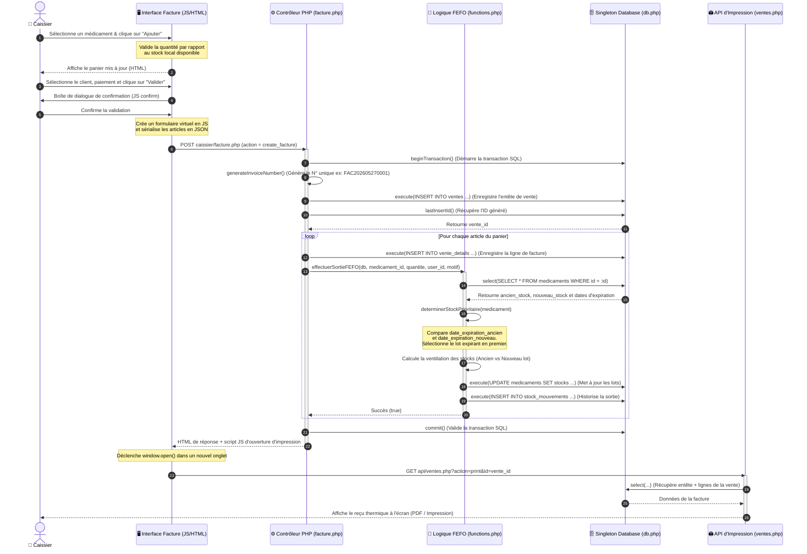
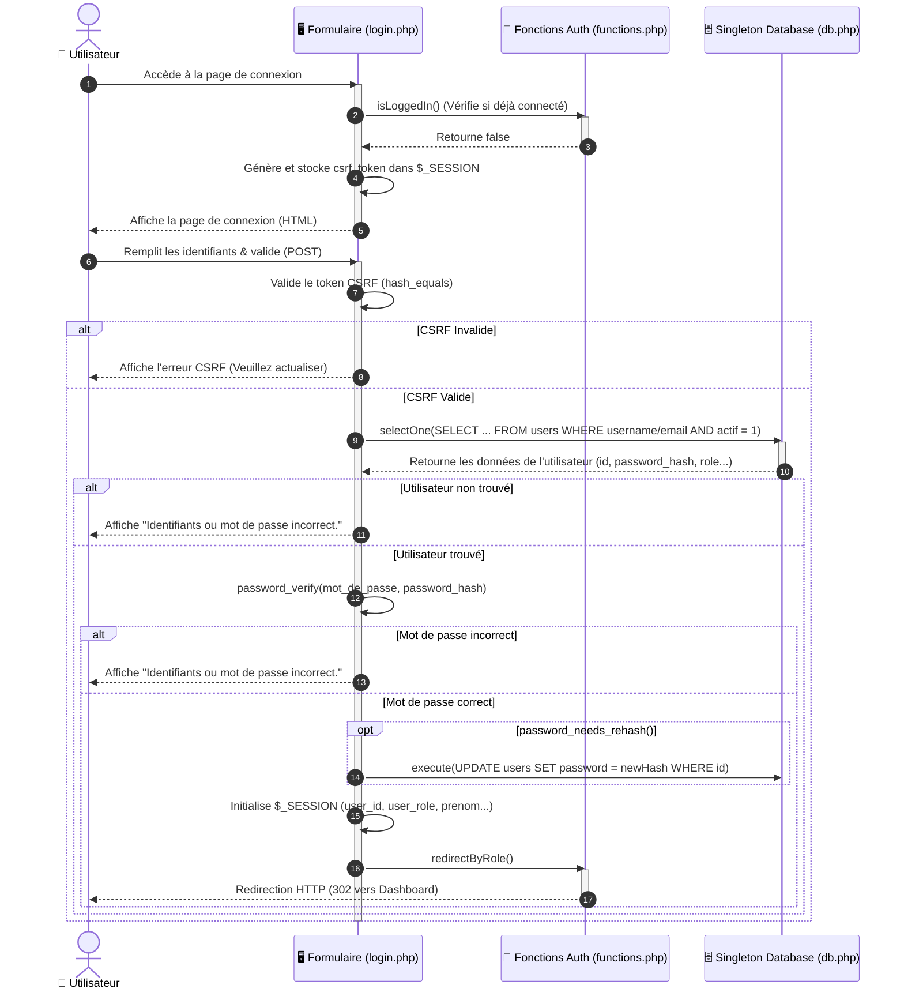

# 🔄 Diagrammes de Séquence (Sequence Diagrams)

Ce document regroupe les diagrammes de séquence clés de l'application **FIANGEP Pharma**, illustrant la dynamique des interactions logiques du système.

---

## 1. Vente et Déstockage FEFO

Ce diagramme illustre la cinématique lors de la **création d'une facture de vente** par un **Caissier**, de l'interface JavaScript à la logique de déstockage **FEFO** (*First Expired, First Out*) et au reçu d'impression.

### 🧜‍♂️ Diagramme Mermaid

### 🔍 Analyse Technique du Flux
1. **Validation Front-End** : L'interface JS locale (`caissier/facture.php`) suit l'état du panier dans la variable globale `panier`. La fonction `ajouterAuPanier` s'assure qu'on ne dépasse pas le stock réel cumulé disponible (`stock_total = ancien_stock + nouveau_stock`).
2. **Soumission Sérialisée** : Pour éviter de multiples requêtes AJAX, l'application utilise une soumission classique de formulaire POST en injectant le panier sous forme de chaîne JSON dans un champ caché `<input type="hidden" name="articles">`.
3. **Transaction et Rétablissement** : La transaction PDO garantit l'atomicité. Si un médicament présente un défaut de stock ou si l'une des écritures de lignes échoue, l'exception est interceptée, et le bloc `catch` exécute un `$db->rollback()`.
4. **Ventilation FEFO dans la Boucle** : La fonction `effectuerSortieFEFO` récupère l'état courant en BDD et décide du lot prioritaire : si l'ancien stock expire avant, on retire en priorité de `ancien_stock`. Si la quantité demandée dépasse l'ancien stock, le reliquat est déduit de `nouveau_stock`.

---

## 2. Authentification et Session

Ce diagramme décrit la cinématique de **connexion d'un utilisateur** via `auth/login.php`, incluant la vérification CSRF, l'authentification sécurisée en base de données et la redirection par rôle.

### 🧜‍♂️ Diagramme Mermaid

### 🔍 Analyse Technique du Flux
1. **Protection CSRF** : Pour se prémunir des attaques CSRF (Cross-Site Request Forgery), l'application génère un token aléatoire unique dans la session et l'inclut en champ masqué dans le formulaire de connexion. Ce token est vérifié avec `hash_equals()` pour éviter toute attaque de type canal auxiliaire ou timing.
2. **Authentification Hybride (Username / Email)** : La requête SQL cherche de manière transparente soit par le nom d'utilisateur, soit par l'email saisi, à condition que le compte soit marqué comme actif (`actif = 1`).
3. **Sécurité Cryptographique** : Les mots de passe ne sont jamais comparés en clair. L'application s'appuie sur `password_verify()` qui s'assure d'une vérification sécurisée contre le hash cryptographique (généralement Bcrypt). De plus, si l'algorithme par défaut de PHP évolue, `password_needs_rehash()` permet de réévaluer et de mettre à jour dynamiquement la clé de sécurité.
