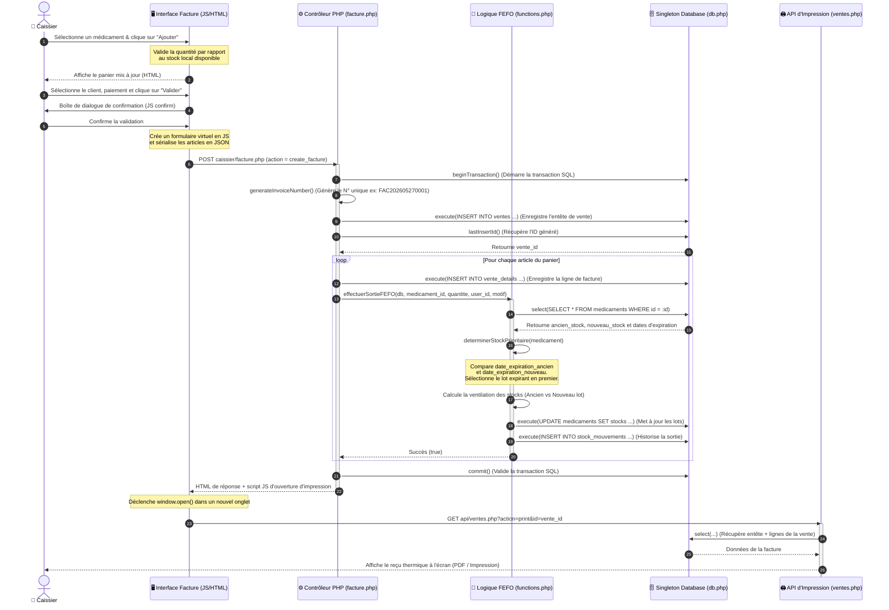

# 🔄 Diagramme de Séquence (Sequence Diagram)

Ce diagramme de séquence illustre la cinématique d'interaction lors de la **création d'une facture de vente** par un **Caissier**, depuis l'interface utilisateur JavaScript jusqu'à l'exécution de la logique de déstockage **FEFO** (*First Expired, First Out*) et la génération du reçu d'impression.

---

## 🧜‍♂️ Diagramme Mermaid

---

## 🔍 Analyse Technique du Flux

1. **Validation Front-End (Étapes 1-2)** :
   L'interface JS locale (`caissier/facture.php`) suit l'état du panier dans la variable globale `panier`. La fonction `ajouterAuPanier` s'assure qu'on ne dépasse pas le stock réel cumulé disponible (`stock_total = ancien_stock + nouveau_stock`).

2. **Soumission Sérialisée (Étape 6)** :
   Pour éviter de multiples requêtes AJAX asynchrones complexes, l'application utilise une soumission classique de formulaire POST en injectant le panier sous forme de chaîne JSON dans un champ caché `<input type="hidden" name="articles">`.

3. **Transaction et Rétablissement (Étapes 7-21)** :
   La transaction PDO garantit l'atomicité. Si un médicament présente un défaut de stock ou si l'une des écritures de lignes échoue, l'exception est interceptée, et le bloc `catch` exécute un `$db->rollback()` pour annuler toutes les modifications précédentes (comme la création de la ligne `ventes` ou des premiers détails).

4. **Ventilation FEFO dans la Boucle (Étapes 13-19)** :
   C'est le cœur de l'intelligence métier. La fonction `effectuerSortieFEFO` récupère l'état courant en BDD et décide du lot prioritaire.
   * Si l'ancien stock expire avant, on retire en priorité de `ancien_stock`. Si la quantité demandée dépasse l'ancien stock, le reliquat est déduit de `nouveau_stock`.
   * Cette mise à jour est immédiatement répercutée via un `UPDATE` en SQL, et un mouvement de stock avec le type `sortie` est tracé.
