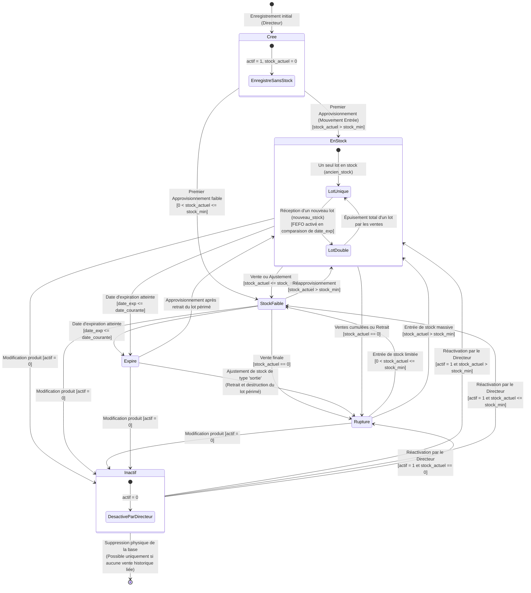

# 🔄 Diagramme d'État-Transition (State-Transition Diagram)

Ce diagramme d'état-transition suit le **cycle de vie complet et l'évolution des états d'un médicament (ou de ses lots de stock)** au sein de l'application **PharmaApp**. Il met en relief l'impact des ventes, du réapprovisionnement, des dates d'expiration (FEFO), ainsi que les décisions d'activation/désactivation prises par le **Directeur**.

---

## 🧜‍♂️ Diagramme Mermaid

---

## 📝 Explication des États du Cycle de Vies

### 1. `Cree` (Nouveau médicament)
Le médicament est déclaré en base par le Directeur (avec saisie du nom, de la catégorie, du prix d'achat, du prix de vente, et du seuil d'alerte `stock_min`). À ce stade, sa quantité physique est à zéro, il est donc enregistré sans stock et ne peut pas figurer dans le panier de facturation d'un caissier.

### 2. `En Stock` (Disponible)
Le médicament possède des quantités physiques supérieures au seuil d'alerte configurable. C'est l'état nominal d'exploitation. Sous Mermaid, nous avons modélisé un **Sous-État** décrivant l'organisation interne :
* **`LotUnique`** : Un seul lot est disponible en pharmacie (soit uniquement `ancien_stock` soit uniquement `nouveau_stock`).
* **`LotDouble`** : Deux lots d'approvisionnement coexistent simultanément avec des dates d'expiration distinctes. Le système bascule automatiquement en mode **FEFO strict**, orientant les ventes prioritaires sur le lot expirant en premier.

### 3. `Stock Faible`
Cet état déclenche l'affichage d'un badge orange d'avertissement dans l'interface du caissier et alimente le tableau de bord exclusif du Directeur (`admin/stock_alert.php`). Il invite le Directeur à passer une nouvelle commande fournisseur avant la rupture. Le médicament reste néanmoins disponible à la vente.

### 4. `Rupture` (Épuisé)
Le stock total cumulé est égal à 0. Dans cet état, le bouton "Ajouter au panier" dans l'interface de facturation est automatiquement désactivé ou masque le produit, et le système bloque toute tentative de forçage côté serveur en renvoyant une erreur.

### 5. `Expire` (Périmé)
La date d'expiration de l'un ou des deux lots est inférieure ou égale à la date du jour. La logique de validation PHP dans `getDateExpirationActive()` filtre ces lots. L'application exige un mouvement d'ajustement manuel (sortie) pour extirper et détruire les produits périmés de l'inventaire physique, faisant transiter le médicament vers l'état de Rupture avant un nouvel approvisionnement sain.

### 6. `Inactif` (Désactivé)
Le Directeur a édité le produit et décoché la case d'activité (`actif = 0`). Le médicament est immédiatement masqué de toutes les vues opérationnelles (catalogue caissier, formulaires d'approvisionnement). Cet état permet d'archiver proprement un produit qui ne sera plus commercialisé sans pour autant le supprimer physiquement de la base de données, préservant ainsi l'intégrité référentielle de l'historique des anciennes factures de ventes.
