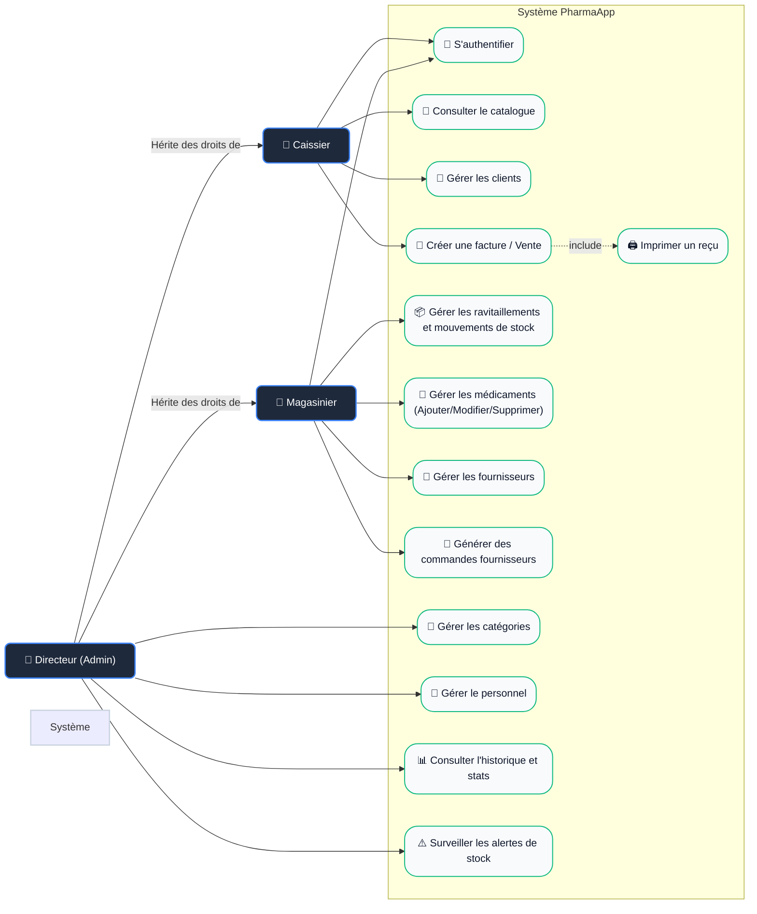

# 📊 Diagramme de Cas d'Utilisation (Use Case Diagram)

Ce diagramme modélise les fonctionnalités du système **PharmaApp** du point de vue des acteurs et utilisateurs. Il inclut désormais le nouveau rôle **Magasinier**.

---

## 🧜‍♂️ Diagramme Mermaid

---

## 📝 Description des Cas d'Utilisation

### 👥 Acteurs
1. **Caissier** : Le rôle opérationnel. Il s'occupe des interactions directes avec les clients au comptoir (vente, facturation, encaissement).
2. **Magasinier** : Le rôle logistique. Il s'occupe des ravitaillements de stock des médicaments, gère le catalogue des médicaments, les fournisseurs, et génère les commandes.
3. **Directeur (Admin)** : Le rôle de gestion administrative et de supervision. Il hérite de toutes les capacités du Caissier et du Magasinier. Il possède le contrôle exclusif sur le personnel, les catégories et rapports financiers.

### 🎯 Cas d'Utilisation Clés
* **🔑 S'authentifier** : Premier niveau d'accès. L'application utilise `session_start()` et stocke le `user_id` et le `user_role` après vérification du hachage du mot de passe (`password_verify`).
* **🧾 Créer une facture / Enregistrer une vente** : Le caissier sélectionne des médicaments et les ajoute à un panier virtuel.
* **📦 Gérer les ravitaillements et mouvements de stock** : Permet au Magasinier ou Directeur d'enregistrer les entrées fournisseurs (FEFO), sorties et ajustements.
* **📝 Générer des commandes fournisseurs** : Le Magasinier (ou Directeur) sélectionne des médicaments en fonction du stock, associe un fournisseur et génère une commande (avec statuts : en_attente, confirmee, livree, annulee).
